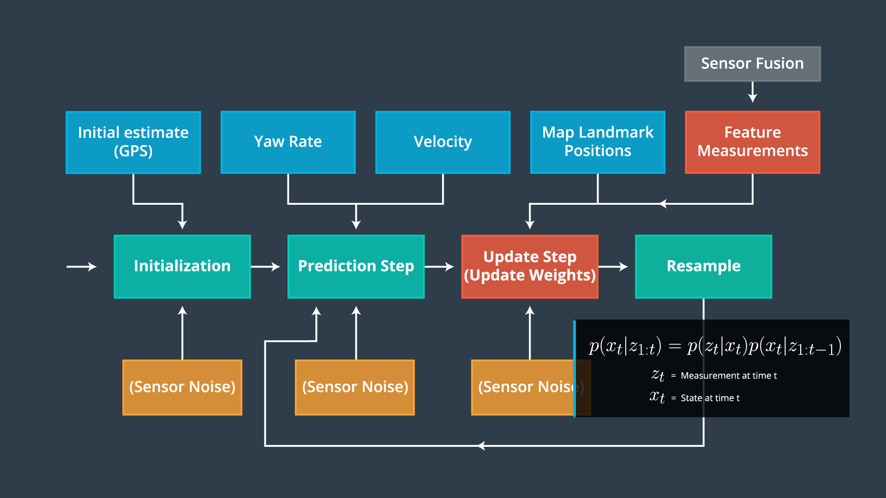
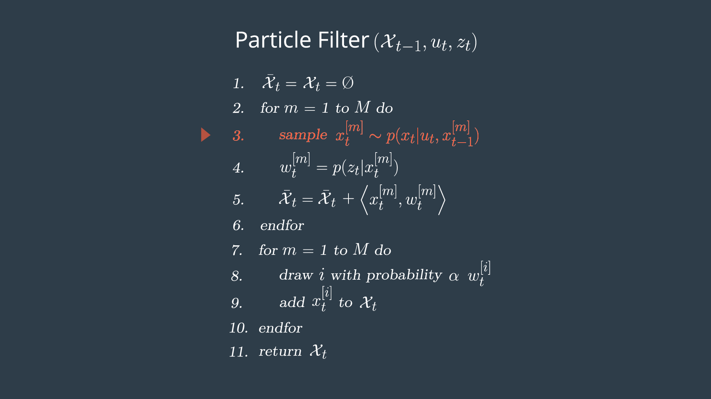
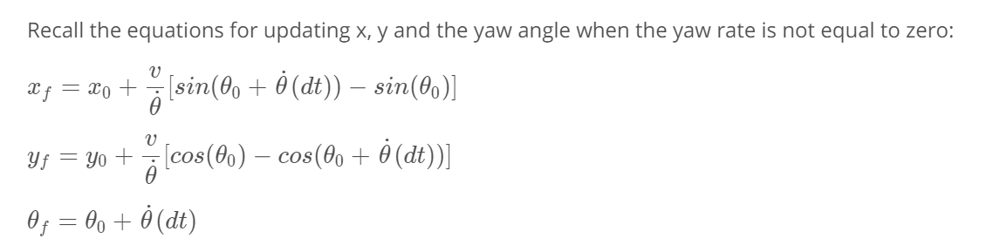
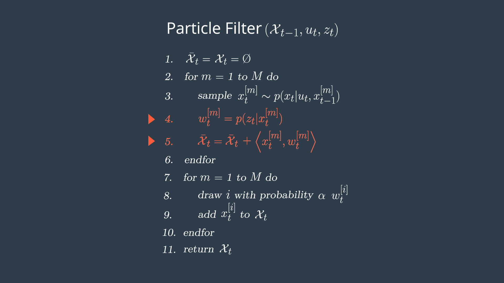
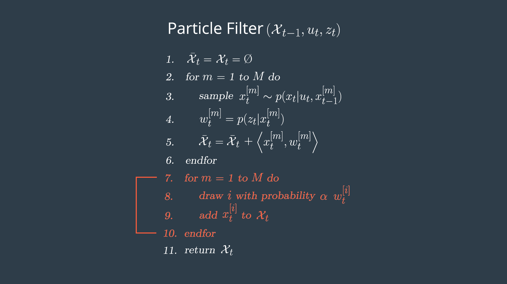

# Particle Filter

### Particle Filter Algorithm Flowchart

### Psuedo Code
To implement a particle filter for localizing an autonomous vehicle. The pseudo code steps correspond to the steps in the algorithm flow chart, initialization, prediction, particle weight updates, and resampling.
- Python implementation of these steps was covered in robot.py

### Initialization
At the initialization step we estimate our position from GPS input. 
- The subsequent steps in the process will refine this estimate to localize our vehicle.

### Prediction
During the prediction step we add the control input (yaw rate & velocity) for all particles

Example: Given the car’s last position was at $(102m, 65m)$ with a heading of $\frac{5\pi}{8} radians$, the car’s velocity was 110 $\frac{m}{s} $, and the car’s yaw rate was $\frac{\pi}{8} \frac{rad}{s} $ over the last 0.1 seconds, what is the car’s new position and heading?

- New position $x_f = 102 + \frac{110}{\pi/8}[sin(\frac{5\pi}{8} + \frac{\pi}{8}*0.1) - sin(\frac{5\pi}{8})] = 97.59$
- New position $y_f = 65 + \frac{110}{\pi/8}[cos(\frac{5\pi}{8}) - cos(\frac{5\pi}{8} + \frac{\pi}{8}*0.1))] =  75.0774$
- New heading $\theta_f = \frac{5\pi}{8} + \frac{\pi}{8}*0.1 = \frac{5.1\pi}{8} = 2.002765$

### Update
During the update step, we update our particle weights using map landmark positions and feature measurements.

#### Update Example - [video lecture](https://youtu.be/BrQfVd4JXpg)

In this exampe we have a car (ground truth position) that observes three nearby landmarks, each one labeled OBS1, OBS2, OBS3. Each observation measurement has x, and y values in the car's coordinate system. We have a particle "P" (estimated position of the car) above with position (4,5) on the map with heading -90 degrees. The first task is to transform each observation marker from the vehicle's coordinates to the map's coordinates, with respect to our particle.

Observations in the car coordinate system can be transformed into map coordinates through a homogenous transformation matrix below. 

+ OBS1 in car coordinate is (2,2). what is OBS1 in map coordinates (x_map,y_map)?
$ x_m = x_p + (cosθ*x_c) − (sinθ×y_c) = 4 + cos(\frac{-pi}{2})*2 - sin(\frac{-pi}{2})*2 = 6.0 $
$ y_m = y_p + (sinθ*x_c) + (cosθ×y_c) = 5 + sin(\frac{-pi}{2})*2 + cos(\frac{-pi}{2})*2 = 3.0 $
+ OBS2 in car coordinate is (3,-2). what is OBS2 in map coordinates (x_map,y_map)?
$ x_m = x_p + (cosθ*x_c) − (sinθ×y_c) = 4 + cos(\frac{-pi}{2})*3 - sin(\frac{-pi}{2})*-22 = 2.0 $
$ y_m = y_p + (sinθ*x_c) + (cosθ×y_c) = 5 + sin(\frac{-pi}{2})*3 + cos(\frac{-pi}{2})*-2 =  2.0 $
+ OBS3 in car coordinate is (0,-4). Transformed observation TOBS3 = (0, 5).
+ TOBS1 = (6, 3) associated with L1, TOBS2 = (2, 2) associated with L2, TOBS1 = (0, 5) associated with L2 or L5

### Resampling
During resampling we will resample M times (M is range of 0 to length_of_particleArray) drawing a particle i (i is the particle index) proportional to its weight.

Sebastian covered one implementation of this in his [discussion and implementation of a resampling wheel](https://youtu.be/wNQVo6uOgYA).

### Return New Particle Set
The new set of particles represents the Bayes filter posterior probability. 
- We now have a refined estimate of the vehicles position based on input evidence.
  