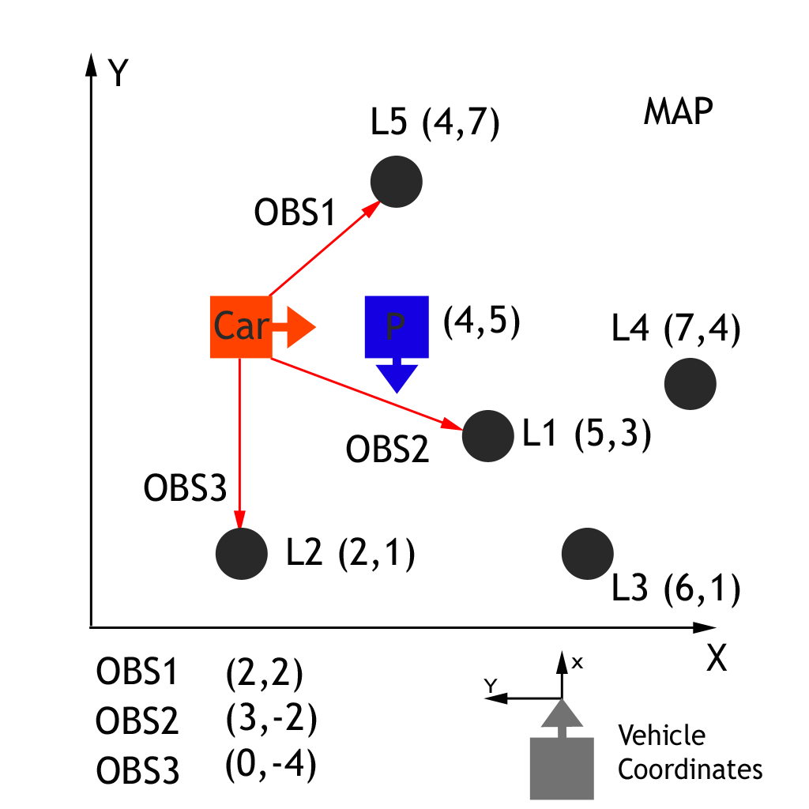
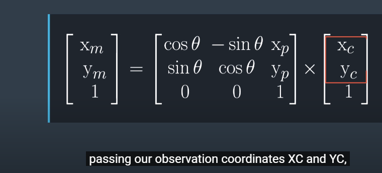
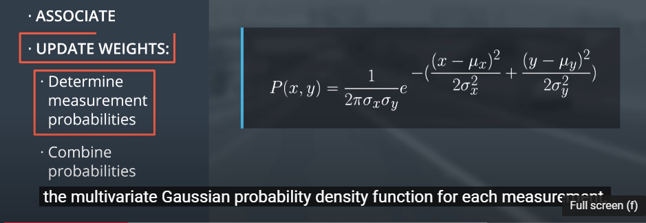

# Transformations and Associations
- Perform observation measurement transformations, along with identifying measurement landmark associations in order to correctly calculate each particle's weight.
  
- Goal is to find a weight parameter for each particle that represents how well that particle fits to being in the same location as the actual car.
 
 ### Given a single particle with its position and heading along with the car's observation measurements. 
- We will first need to transform the car's sensor landmark measurements from its local car coordinate system to the map's coordinate system. 
- Next, each measurement will need to be associated with a landmark identifier
    - for this part we will take the closest landmark to each transformed observation 
- Finally, we will use this information to calculate the weight value of the particle.

### Example
- Here we have a car (ground truth position) that observes three nearby landmarks, each one labeled $OBS1, OBS2, OBS3$
- Each observation measurement has x, and y values in the car's coordinate system. 
- We have a particle $P$ (estimated position of the car) above with position (4, 5) on the map with heading -90 degrees. 
- **The first task is to transform each observation marker from the vehicle's coordinates to the map's coordinates, with respect to particle $P$.**





- [video lecture](https://youtu.be/BrQfVd4JXpg)
- Transformed Observation (x_map,y_map) = func(x_particle, y_particle, heading_particle, x_obs, y_obs)
1. Transform the car sensor landmark observations from its local car coordinate system to the map's coordinate system. 
2. Associating the transformed observations with the nearest landmark on the map
    + Need to convert car sensor landmark observation from car's coordinate system to map's coordinate system using homogenous transformation (rotation and translation) 
    + I.e. rotate map's frame to match particle point of view, then move origin of the frame to the location of the particle - all can be done by multiplying a transformation matrix
    
    + OBS1 in car coordinate is (2,2). what is OBS1 in map coordinates (x_map,y_map)?
    $ x_m = x_p + (cosθ*x_c) − (sinθ×y_c) = 4 + cos(\frac{-pi}{2})*2 - sin(\frac{-pi}{2})*2 = 6.0 $
    $ y_m = y_p + (sinθ*x_c) + (cosθ×y_c) = 5 + sin(\frac{-pi}{2})*2 + cos(\frac{-pi}{2})*2 = 3.0 $
    + OBS2 in car coordinate is (3,-2). what is OBS2 in map coordinates (x_map,y_map)?
    $ x_m = x_p + (cosθ*x_c) − (sinθ×y_c) = 4 + cos(\frac{-pi}{2})*3 - sin(\frac{-pi}{2})*-22 = 2.0 $
    $ y_m = y_p + (sinθ*x_c) + (cosθ×y_c) = 5 + sin(\frac{-pi}{2})*3 + cos(\frac{-pi}{2})*-2 =  2.0 $
    + OBS3 in car coordinate is (0,-4). Transformed observation TOBS3 = (0, 5).
    + TOBS1 = (6, 3) associated with L1, TOBS2 = (2, 2) associated with L2, TOBS1 = (0, 5) associated with L2 or L5
  
    ```
        landmarks = [(5, 3), (2, 1), (6, 1), (7, 4), (4, 7)]
        
        # x is transformed landmark observation1 vector in map coordinate
        x = (6, 3)
        dist_x_to_landmarks = [(x[0]-y[0])**2 + (x[1]-y[1])**2 for y in landmarks]

        # Look at dist_x_to_landmarks and found L1 is the nearest landmark to TOBS1
        dist_x_to_landmarks = [1, 20, 4, 2, 20]
    ```
3. Update each partitcle weight by applying the multivariate Gaussian probability density function for earch landmark measurement with respect to $P$
   

    a. $(x, y)$ is car sensor landmark observation in the map's coordinate system with repsect to particle $P$.
        E.g. Tobs1 = (6, 3)
    b. $(\mu_x, \mu_y) $ is the nearest landmark position in the map's coordinate system
        E.g. L1 = (5, 3)
    c. Multivariate-Gaussian probability density of OBS1,  OBS2,  OBS3
    - $ P(x, y)_1 =  (1/(2*pi*0.3*0.3)) * exp(-(((6-5)**2)/(2*(0.3**2)) + 0 )) = 6.84E-3 $
    - $ P(x, y)_2 = 6.84E-3 $
    - $ P(x, y)_3 = 9.83E-49 $
    
4. Combining the probabilities of **all the measurements** by taking their product.
   Weight of particle $P = 6.84E-3 * 6.84E-3 * 9.83E-49 = 4.60E-53$
   